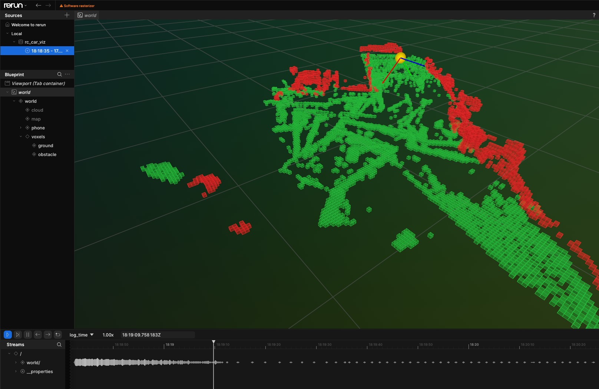

# Autonomous RC Car — iPhone LiDAR, laptop ROS2 graph, ESP32 motors

A four-wheel floor robot that maps a room in 3D and explores it without a
driver.

The robot has no dedicated LiDAR unit, no wheel encoders, and no onboard
computer. An **iPhone 12 Pro Max** mounted on the chassis provides all sensing:
its ARKit dToF LiDAR produces the point cloud and its VIO produces a 6-DoF pose.
The phone streams both to a **laptop** over Wi-Fi. A **ROS2 Humble** graph on the
laptop converts them into a voxel map, an occupancy grid, an exploration goal and
an A\* path, and finally into two motor values. Those values go over Wi-Fi to an
**ESP32**, which drives a TB6612FNG H-bridge and four motors.

Responsibilities are split as follows: the phone only senses, the laptop makes
all decisions, and the ESP32 only sets motor PWM. This split is intentional and
explains several design choices in the code — see [Design rules](#13-design-rules).



---

## Table of contents

1. [Hardware](#1-hardware)
2. [End-to-end data flow](#2-end-to-end-data-flow)
3. [Wire protocols](#3-wire-protocols)
4. [The ROS2 graph](#4-the-ros2-graph)
5. [The software: voxels, mapping, path finding](#5-the-software-voxels-mapping-path-finding)
6. [Coordinate frames](#6-coordinate-frames)
7. [Calibration](#7-calibration)
8. [Install](#8-install)
9. [Running it — commands](#9-running-it--commands)
10. [Configuration & tuning](#10-configuration--tuning)
11. [Repository layout](#11-repository-layout)
12. [Tests](#12-tests)
13. [Design rules](#13-design-rules)
14. [Status & document index](#14-status--document-index)

---

## 1. Hardware

| Piece | What it is | Role |
|---|---|---|
| iPhone 12 Pro Max | ARKit + dToF LiDAR, mounted on the chassis | Point cloud + 6-DoF pose + camera JPEG |
| Laptop | Windows host, ROS2 Humble inside WSL2 (Ubuntu 22.04) | SLAM, mapping, planning, control, visualization |
| ESP32 | Wi-Fi MCU, TCP line server on port 9001 | PWM to the H-bridge, 500 ms failsafe stop |
| TB6612FNG | Dual H-bridge | Two logical sides (differential/tank drive) |
| 4 × DC motors | Two per side, wired in parallel per side | Drive |
| 2 × 18650 (7.4 V) | Motor battery on `VM` | Motor power (the ESP32 runs off its own USB power bank) |

**ESP32 ↔ TB6612 pinout** (from `esp32_firmware/src/esp32_car_wifi_tb6612.ino`):

```
STBY -> GPIO 22            (must be HIGH to enable the driver)
Motor A (LEFT)             Motor B (RIGHT)
  AIN1 -> GPIO 18            BIN1 -> GPIO 16
  AIN2 -> GPIO 19            BIN2 -> GPIO 17
  PWMA -> GPIO 23            PWMB -> GPIO 21
PWM: 20 kHz, 8-bit (0..255) — above the audible range
```

The battery negative, the TB6612 GND and the ESP32 GND must share a common
ground at a single connection point. Without it the link is unreliable.

---

## 2. End-to-end data flow

```
┌──────────────────────────────────────────────────────────────────────┐
│ iPhone — RCCarLidarStreamer (SwiftUI + ARKit)                        │
│   ARFrame ──► sceneDepth (dToF) + camera.transform (VIO 6-DoF)       │
│   unproject depth → world points, accumulate, colorize               │
│   PointCloudStreamer: TCP client, little-endian framed messages      │
└───────────────────────────┬──────────────────────────────────────────┘
                            │  Wi-Fi TCP :9000       (phone = client)
                            │  'P' points  'O' pose  'I' jpeg   ──►
                            │  ◄── 'M' sensor mode (IDLE/SCAN/DRIVE)
┌───────────────────────────▼──────────────────────────────────────────┐
│ Laptop — ROS2 Humble graph (WSL2)                                    │
│                                                                      │
│  bridge_node      TCP server :9000, decodes frames, ARKit→ROS frame  │
│      ├─► /points  sensor_msgs/PointCloud2                            │
│      ├─► /pose    geometry_msgs/PoseStamped                          │
│      └─► /image   sensor_msgs/CompressedImage                        │
│                                                                      │
│  icp_slam_node    /points + /pose ─ICP─► /pose_corrected             │
│  voxel_mapper     /points + /pose ──► /map, /voxels/{ground,obstacle}│
│  frontier_planner /map + /pose ─frontier+A*─► /cmd_path              │
│  motion_controller /cmd_path + /pose ─turn-then-drive─► /drive       │
│  scan_node        commands a 360° spin, gates the phone's depth      │
│  calibration_node measures this car against the pose ► calibration.yaml
│  rerun_viz_node   everything ──► Rerun 3D viewer                     │
│  motion_enable_node  keyboard input (GO / HOLD / plan / scan / cal)  │
└───────────────────────────┬──────────────────────────────────────────┘
                            │  Wi-Fi TCP :9001       (laptop = client)
                            │  "L<left>R<right>\n"  ──►  ◄── "ok\n"
┌───────────────────────────▼──────────────────────────────────────────┐
│ ESP32 — esp32_car_wifi_tb6612.ino                                    │
│   parse line → clamp −100..100 → PWM duty → TB6612 → 4 motors        │
│   no command for 500 ms → STOP (failsafe)                            │
└──────────────────────────────────────────────────────────────────────┘
```

### The loop, step by step

1. **Sense.** Press `s`. `scan_node` stops the car, puts the phone in `SCAN` mode
   so it starts computing depth, spins the car in place while watching `/pose`
   until it has turned a full 2π, stops, and returns the phone to `IDLE`. Depth
   processing is power-intensive on the phone, so it runs only during scans.
2. **Ingest.** `bridge_node` decodes the framed stream and republishes it as ROS
   topics, converting from ARKit's Y-up world into ROS's Z-up world at that
   boundary.
3. **Correct.** `icp_slam_node` accumulates a downsampled map and, on a 2 s timer,
   runs point-to-point ICP of the recent scan against it. The resulting rigid 4×4
   transform is applied to every incoming pose and republished as
   `/pose_corrected`. Corrections larger than `max_jump` (0.5 m) are rejected.
4. **Map.** `voxel_mapper_node` ray-carves each point batch into a persistent
   log-odds voxel grid, then flattens the occupied voxels into a 2D occupancy
   grid with the robot radius inflated. Published as `/map`.
5. **Plan.** Press `p`. `frontier_planner_node` finds the nearest reachable
   frontier (a free cell adjacent to unknown space), runs A\* to it, simplifies
   the cell-by-cell path into a few line-of-sight legs, and publishes `/cmd_path`.
6. **Drive.** Press `g`. `motion_controller_node` runs a turn-then-drive waypoint
   follower at 10 Hz and publishes `L<left>R<right>` on `/drive`.
7. **Actuate.** `car_driver_node` applies the measured calibration (straightness
   trim, stiction deadband) and writes the line to the ESP32's TCP socket. The
   ESP32 sets PWM. If no command arrives for 500 ms, the ESP32 stops the motors.
8. Repeat from step 1 until no reachable frontier remains.

---

## 3. Wire protocols

### 3.1 Phone ↔ laptop (TCP :9000, laptop is the server)

Defined in `laptop_brain/nav/stream_protocol.py` and mirrored in
`ios_app/RCCarLidarStreamer/PointCloudStreamer.swift`. Every message:

```
┌────────┬──────────────────────┬───────────────┐
│ type   │ payload length       │ payload       │
│ 1 byte │ uint32 little-endian │ length bytes  │
└────────┴──────────────────────┴───────────────┘
```

**Phone → laptop**

| Type | Byte | Payload |
|---|---|---|
| `'P'` points | `0x50` | `uint32 count`, then per point `float32 x,y,z` + `uint8 r,g,b` — **15 bytes/point** |
| `'O'` pose | `0x4F` | 16 × `float32`, the camera→world 4×4 in **column-major** order |
| `'I'` image | `0x49` | raw JPEG bytes of a downscaled camera frame |

**Laptop → phone**

| Type | Byte | Payload |
|---|---|---|
| `'M'` mode | `0x4D` | ASCII `IDLE` \| `SCAN` \| `DRIVE` — controls when the phone computes depth |
| `'D'` drive | `0x44` | ASCII `L<left>R<right>` — legacy BLE relay path, unused by the Wi-Fi car |

Unknown message types are ignored by both ends, so an older app version remains
compatible with a newer laptop and the reverse.

### 3.2 Laptop ↔ ESP32 (TCP :9001, ESP32 is the server)

Raw TCP, one ASCII command per line, no framing:

| Line | Meaning | Reply |
|---|---|---|
| `L<left>R<right>\n` | each side −100..100, for example `L60R-40` | `ok\n` |
| `S\n` | immediate stop | `ok\n` |
| anything else | ignored | `err\n` |

The `ok\n` reply lets `car_driver_node` measure link round-trip time and display
it in the console. The ESP32 advertises itself over mDNS as `rccar.local` and
prints its IP address on serial at boot.

---

## 4. The ROS2 graph

Package: `ros2_ws/src/autonomous_rc_car_ros` (ament_python, ROS2 Humble).
Ten executables. Nine launch from `bringup.launch.py`; the tenth
(`motion_enable_node`) requires a TTY and is run in the foreground by `run.sh`.

### Nodes

| Node | Subscribes | Publishes | Job |
|---|---|---|---|
| `bridge_node` | `/drive`, `/sensor_mode` | `/points`, `/pose`, `/image` | TCP server :9000; decodes the phone stream; ARKit→ROS frame conversion |
| `icp_slam_node` | `/points`, `/pose` | `/pose_corrected` | Scan-to-map ICP drift correction (Open3D) |
| `voxel_mapper_node` | `/points`, `/pose` | `/map`, `/voxels/ground`, `/voxels/obstacle` | Log-odds voxel grid with ray carving, then an inflated 2D occupancy grid |
| `frontier_planner_node` | `/map`, `/pose`, `/plan_trigger` | `/cmd_path` (latched) | Nearest reachable frontier, A\*, line-of-sight simplification |
| `motion_controller_node` | `/cmd_path`, `/pose`, `/motion_enable`, `/calibration_result` | `/drive`, `/drive_intended` | Turn-then-drive waypoint follower at 10 Hz |
| `car_driver_node` | `/drive`, `/drive_raw`, `/calibration_active`, `/scan_active`, `/calibration_result` | `/car_link` | Applies calibration, writes lines to the ESP32, reconnects, measures RTT |
| `scan_node` | `/pose`, `/scan_trigger`, `/motion_enable` | `/drive_raw`, `/scan_active`, `/sensor_mode`, `/scan_status` | On-demand 360° scan with phone depth gating |
| `calibration_node` | `/pose`, `/calibrate_trigger`, `/motion_enable`, `/car_link` | `/drive_raw`, `/calibration_active`, `/calibration_status`, `/calibration_result` | Measures deadband, gains, trim and latency against the ARKit pose |
| `rerun_viz_node` | `/points`, `/voxels/*`, `/map`, `/cmd_path`, `/pose` | — | Streams everything into a Rerun 3D viewer |
| `motion_enable_node` | `/cmd_path`, `/drive_intended`, `/car_link`, `/calibration_*`, `/scan_*`, `/sensor_mode` | `/motion_enable`, `/plan_trigger`, `/calibrate_trigger`, `/scan_trigger` | Keyboard console for operator control |

### Motor ownership arbitration

Three subsystems can command the motors, so ownership is explicit rather than
first-come-first-served. `motion_controller_node` publishes `L0R0` at 10 Hz even
while in HOLD; without arbitration that stream would overwrite every calibration
move and every scan spin.

- Normal driving uses **`/drive`**, with calibration applied by `car_driver_node`.
- `calibration_node` and `scan_node` use **`/drive_raw`**, which bypasses
  calibration because calibration must measure raw hardware behavior. Both raise
  a latched `/calibration_active` or `/scan_active`.
- While either flag is true, `car_driver_node` **ignores `/drive` entirely**.

### Latched topics

`/cmd_path`, `/motion_enable`, `/car_link`, `/sensor_mode`, `/calibration_*` and
`/scan_*` use `TRANSIENT_LOCAL` durability. A node that starts late, or a viewer
opened after startup, immediately receives the current state instead of waiting
for the next publish.

---

## 5. The software: voxels, mapping, path finding

All algorithms live in `laptop_brain/nav/`, a pip-installable library
(`rc-car-nav`) with **no ROS and no hardware dependency**. The ROS2 nodes are
thin wrappers that convert messages, call into `nav.*`, and publish the result.
This is why the pipeline is unit-testable without a car attached.

### 5.1 `nav/voxel_grid.py` — the 3D map (log-odds occupancy with ray carving)

The persistent world model is a dictionary of `{(ix, iy, iz) → log-odds}` at 3 cm
resolution. Each incoming point batch is integrated as rays from the sensor
origin rather than as isolated hits:

```
voxel_traversal(origin, point, size)     # Amanatides & Woo 3D DDA
  → every integer voxel the segment crosses, in order

for each voxel the ray passes THROUGH:  L(v) -= l_free   (0.4)   free evidence
for the voxel at the ray's ENDPOINT:    L(v) += l_occ    (0.85)  occupied evidence
clamp L(v) to [l_min, l_max] = [-2.0, 3.5]
occupied  ⟺  L(v) > occ_threshold (0.0)
```

Reasons for rays instead of point accumulation:

- **Obstacles that have moved are removed.** If an object is gone, the sensor now
  sees through where it was; those rays drive the log-odds negative and the
  voxels stop being reported as occupied. Point accumulation can only ever add
  occupancy.
- **Clamping bounds how much evidence a voxel can hold.** `l_max = 3.5` means a
  wall can be cleared after a small number of contradicting rays rather than
  hundreds.
- **Cost is bounded.** Integration is O(new points × voxels per ray) per frame
  instead of re-voxelizing the entire accumulated cloud every cycle. Rays are
  range-gated at `max_range = 6.0 m` and the ray count is capped at `max_rays =
  2000` per batch (evenly subsampled), so a dense frame cannot stall the node.

`nav/voxel.py` is the simpler, non-incremental version used for visualization and
tests: bucket points by `floor(p / size)`, keep voxels with at least `min_points`
hits, return their centers. Stateless, with no carving.

### 5.2 `nav/mapping.py` — 3D cloud to 2D navigable grid

The planner operates in 2D, so the voxel world is collapsed onto the floor plane
in four steps:

**1. Clean** (`clean_cloud`) — drop non-finite points, voxel-downsample at 4 cm,
then remove statistical outliers (20 neighbors, 2σ) and radius outliers (at least
4 neighbors within 10 cm). This removes the isolated points ARKit produces at
depth discontinuities. Clouds under 50 points pass through unmodified, since
there are too few neighbors for the statistics to be meaningful.

**2. Find the floor** (`estimate_floor_height`) — histogram the Y (up) values in
2 cm bins. The floor is the **lowest** bin whose count is at least 20% of the
largest bin. The largest bin alone is not reliable because a large table surface
can contain more points than the floor. The minimum Y value is not reliable
either because below-floor noise would win. The lowest strongly-populated bin
handles both cases.

**3. Band by height** (`build_occupancy_grid`) — all thresholds are relative to
the estimated floor:

| Band | Meaning |
|---|---|
| `|y − floor| ≤ 0.04 m` | drivable floor evidence → cell becomes `FREE` |
| `floor + 0.06 < y < floor + 0.35` | obstacle within body height → cell becomes `OCCUPIED` |
| `y > floor + 0.35` | overhead (tabletops, ceiling) → ignored; the car drives underneath |
| `y < floor − 0.15` | noise → ignored |

Cells are 5 cm. A cell requires at least 2 obstacle points to be marked occupied,
so a single stray hit does not create a wall. Cells with no evidence remain
`UNKNOWN`, which is what makes frontier exploration possible. Occupied takes
priority over free.

**4. Inflate** (`inflate`) — a Euclidean distance transform of distance-to-nearest
obstacle, thresholded at the robot radius (0.14 m). Every cell within that
distance is marked `blocked`. An EDT is used rather than repeated binary
dilation because dilation grows a diamond-shaped region while an EDT grows a
circular one, and the diamond would allow the planner to clip corners the
chassis cannot clear.

`grid.passable()` is then `FREE & ~blocked`, a boolean mask used by both the
frontier search and A\*, so the two cannot disagree about which cells are legal.

### 5.3 `nav/frontier.py` — choosing the next goal (Yamauchi 1997)

```
frontier_mask   = passable cells adjacent to UNKNOWN (8-connected dilation)
label clusters  = scipy.ndimage.label on that mask
start           = nearest_passable(car_cell)     # snap out of the inflation ring
dist            = bfs_distances(grid, start)     # 8-connected BFS, in steps
goal            = the closest cell of the closest cluster with ≥12 cells
```

Three implementation details:

- **`min_cluster_size = 12`.** A single unexplored cell is surrounded by 8
  frontier cells, so a lower threshold makes the car target sensor noise. A real
  doorway or room edge at 5 cm resolution spans dozens of cells.
- **`nearest_passable`.** After a scan, the car's own cell is often inside the
  inflation ring of a nearby wall, which would make planning fail immediately.
  The search expands in Chebyshev rings and stops once no later ring could
  contain a closer cell.
- **BFS uses the same no-corner-cutting rule as A\*.** Otherwise BFS-reachable
  would not imply A\*-reachable, and the planner would receive goals it cannot
  route to.

A return value of `None` means exploration is complete: no reachable frontier
remains.

### 5.4 `nav/planner.py` — A\* and line-of-sight simplification

**`astar(passable, start, goal)`** — 8-connected A\* over the boolean mask.
Straight steps cost 1, diagonals cost √2, and the heuristic is the octile
distance `max(dr,dc) + (√2−1)·min(dr,dc)`, which is admissible for that cost
model, so the result is optimal. A diagonal move is **forbidden if either
flanking cardinal cell is blocked**, because the chassis has width and cannot
pass through the gap between two diagonal obstacles.

**`simplify_path(path, passable)`** — raw A\* output contains one waypoint per
5 cm cell, which a turn-then-drive controller would follow with constant small
corrections. Greedy shortcutting solves this: from the current waypoint, jump to
the farthest later path cell still in line of sight, keep that, and repeat. A
corridor reduces to two waypoints.

**`line_clear(passable, a, b)`** — the line-of-sight test. It walks the exact
sequence of cells a center-to-center segment crosses, using parametric boundary
crossings rather than Bresenham so the result is exact, and applies the same
no-corner-cutting rule when the segment passes exactly through a cell corner.
Shortcuts therefore can never be less strict than the A\* path they replace.

> Known worst cases (tracked in `TODO.md`): `bfs_distances` takes about 4.7 s on
> an open 400×400 grid, and `simplify_path` is super-quadratic on maze-like
> input. Neither has occurred in a real room.

### 5.5 `nav/controller.py` — following the path

A turn-then-drive follower for differential drive, ticked at 10 Hz:

```
if distance to current waypoint < stop_distance:   advance to the next one
bearing = atan2(wz − z, wx − x)
err     = shortest signed angle (bearing − theta)

|err| > TURN_THRESHOLD (0.44 rad ≈ 25°)   →  rotate in place at ±TURN_SPEED
otherwise                                 →  drive at DRIVE_SPEED with a
                                             proportional heading correction,
                                             clamped to ±15 motor units
```

`stop_distance` is not a constant. It is `ARRIVE_DIST + linear_gain ×
drive_speed × command_latency`, meaning the arrival radius is widened by the
distance this specific car travels before it responds to a command. On an
uncalibrated car both terms are zero and it reduces to `ARRIVE_DIST`.

`TURN_SIGN`, from calibration, determines which direction `(left=+s, right=−s)`
actually rotates the car, so reversed motor wiring is a configuration value
rather than a code change.

### 5.6 `nav/drift.py` and `icp_slam_node` — VIO drift correction

ARKit VIO drifts slowly and can jump after tracking loss. With no wheel encoders
there is no odometry to fuse, so the correction is derived from geometry: align
the recent scan to the accumulated map and use the residual rigid transform as
the error estimate.

```
map  = voxel_downsample(accumulated cloud, 0.05)     # capped at 200k points
scan = voxel_downsample(recent scan,       0.05)     # requires ≥300 points
T_corr = open3d point-to-point ICP(scan → map, max_corr_dist = 0.15)
reject if ‖translation‖ > max_jump (0.5 m)
pose_corrected = T_corr · pose_arkit                 # applied to every /pose
```

Refined on a 2 s timer and applied continuously. ICP is frame-agnostic, so this
node operates directly in the ROS frame with no conversions.

### 5.7 `nav/ros_export.py` — nav state to ROS payloads

Kept ROS-free (plain NumPy) so it remains testable anywhere. Maps the nav grid
onto `nav_msgs/OccupancyGrid` values: `UNKNOWN → −1`, `FREE → 0`, **inflation
buffer → 99**, `OCCUPIED → 100`. Separating 99 from 100 makes the inflation ring
visible in the viewer, which is useful when diagnosing why the planner refused a
gap.

---

## 6. Coordinate frames

Two conventions meet in this system, and mixing them produces a map that looks
plausible but is incorrect.

- **ARKit** is gravity-aligned with **+Y up**; the floor is the world **x-z**
  plane. The entire `nav` library uses this convention.
- **ROS / RViz / Rerun** uses **+Z up**; the floor is the **x-y** plane.

`nav/frames.py` converts at the boundary only, with a single proper rotation
(right-handed, determinant +1):

```
ros = A · arkit          A = [[1, 0,  0],
                              [0, 0, -1],
                              [0, 1,  0]]
```

`bridge_node` converts inbound; `motion_controller_node`, `scan_node` and
`calibration_node` convert outbound. Everything published to ROS is Z-up, so the
cloud, voxel cubes, pose axes and occupancy grid all appear in one consistent
upright world in the viewer.

The 2D grid stores **rows indexed by world z, columns by world x**, and the
exported ROS map uses `ROS x = world x, ROS y = −world z`. This is the reason for
the row flip and negated origin in `grid_to_occupancy`.

---

## 7. Calibration

The ESP32 firmware maps `0..100` linearly onto PWM duty and contains no
compensation for stiction or mismatched motors. Those values are measured on the
laptop and stored in `config/calibration.yaml`, so **recalibrating never requires
reflashing or rebuilding**.

Press `c` in the console. `calibration_node` runs a scripted drive sequence and
watches the raw ARKit `/pose` rather than `/pose_corrected`, because ICP applies
discrete jumps that would corrupt these short-move measurements:

| Stage | What it measures |
|---|---|
| 1. preflight | pose is fresh, car link is up |
| 2. deadband | ramp until motion begins — forwards, then rotating |
| 3. turn sign | whether `(left=+s, right=−s)` increases or decreases θ |
| 4. angular gain | rad/s per motor unit, fitted from spins at three speeds |
| 5. straight run | m/s per unit, straightness trim, and command latency |
| 6. verification | one more straight run with the trim applied |

Results are written to `config/calibration.yaml` and announced on
`/calibration_result`. `car_driver_node` and `motion_controller_node` re-read them
live, with no restart required. The current measured file:

```yaml
turn_sign: -1                    # motors are wired in reverse; handled in config
drive_deadband: 24               # below 24 units the motors do not turn
turn_deadband: 32
linear_gain: 0.00284             # m/s per motor unit
angular_gain: -0.00416           # rad/s per motor unit
straightness_trim: -0.5          # right side is stronger; weaken it
command_latency: 0.258           # seconds from publish to visible motion
```

`Calibration.apply(left, right)` trims the two sides apart, then raises each
nonzero magnitude above the stiction deadband. A zero command stays exactly zero,
so the car does not move while stopped.

> **Safety:** calibration cannot be run with the wheels off the ground, because it
> measures real motion. It requires roughly 2×2 m of clear floor and drives
> forward about 1.5 m. Press `h` or SPACE to abort at any point.

---

## 8. Install

### 8.1 Laptop (WSL2 + ROS2 Humble)

ROS2 support on native Windows is limited, so the graph runs in WSL2. Full
walkthrough in `autonomous_rc_car/ROS2_SETUP.md`.

```bash
# Windows, admin PowerShell
wsl --install -d Ubuntu-22.04          # 22.04 (Jammy) — Humble targets it, not 24.04
```

```bash
# inside Ubuntu: ROS2 Humble
sudo apt install -y ros-humble-ros-base python3-colcon-common-extensions \
  ros-humble-sensor-msgs-py ros-humble-nav-msgs ros-humble-geometry-msgs
echo "source /opt/ros/humble/setup.bash" >> ~/.bashrc && source ~/.bashrc

# the nav library (Ubuntu 22.04 ships pre-PEP-660 setuptools, so upgrade first)
pip3 install --upgrade pip setuptools wheel
cd "/mnt/c/.../Remote Car/autonomous_rc_car"
pip3 install -e ./laptop_brain          # installs rc-car-nav → import nav
pip3 install rerun-sdk                  # optional: the 3D visualizer
```

### 8.2 WSL2 networking — the phone must reach port 9000

By default WSL2 is NAT'd behind its own `172.x.x.x` address, so a phone on the
Wi-Fi network cannot reach `bridge_node`. Choose one option:

**A — mirrored networking (Windows 11, simplest).** In `C:\Users\<you>\.wslconfig`:

```ini
[wsl2]
networkingMode=mirrored
```

Then run `wsl --shutdown` and reopen. WSL now shares the host's LAN IP.

**B — port proxy (older Windows).** Re-run after every WSL restart, because the
WSL IP changes:

```powershell
$wsl = (wsl hostname -I).Trim().Split()[0]
netsh interface portproxy add v4tov4 listenport=9000 listenaddress=0.0.0.0 connectport=9000 connectaddress=$wsl
New-NetFirewallRule -DisplayName "WSL ROS2 9000" -Direction Inbound -LocalPort 9000 -Protocol TCP -Action Allow
```

In the app, enter the **Windows** LAN IP from `ipconfig`, not the WSL IP.

### 8.3 ESP32

Set `WIFI_SSID` and `WIFI_PASS` at the top of
`esp32_firmware/src/esp32_car_wifi_tb6612.ino`, then flash with the Arduino IDE
(ESP32 core v3.x — for v2.x see the note in `setupPWM()`) or PlatformIO. The
board prints its IP on serial at boot and registers as `rccar.local`.

### 8.4 iPhone

Open `ios_app/RCCarLidarStreamer/` in Xcode, set the signing team, and deploy to
a LiDAR-equipped iPhone (12 Pro or later). Enter the laptop's LAN IP in the app
and tap Connect. See `ios_app/RCCarLidarStreamer/README.md`.

---

## 9. Running it — commands

### The one command

```bash
cd autonomous_rc_car
./run.sh
```

This sources ROS2 and the workspace, builds if the workspace has never been
built, clears orphaned DDS shared-memory segments, launches all nine background
nodes plus the Rerun viewer, and runs the control console in the current
terminal. Quitting the console (`q`) or pressing Ctrl-C shuts down the whole
graph.

With the car:

```bash
./run.sh --car 192.168.1.42        # or --car rccar.local (the default)
```

### Console keys

| Key | Action |
|---|---|
| `s` | **Scan** — drop to HOLD, spin 360° in place, capture depth, return to IDLE |
| `c` | **Calibrate** — run the measurement sequence (requires clear floor) |
| `p` | **Plan** — compute one path from the current map and display it |
| `g` | **GO** — arm driving; the controller starts following `/cmd_path` |
| `h` or SPACE | **HOLD** — disarm; also aborts a running scan or calibration |
| `q` | Quit and shut down the graph |

The status line shows the car link, the phone's `lidar:` sensor mode (`IDLE` is
the normal resting state), the waypoint count and the live drive command.
**The default state is HOLD** — the car does not move until you press `g`, `c` or
`s`.

### `run.sh` flags

| Flag | Effect |
|---|---|
| `--car HOST[:PORT]` | ESP32 address (default `rccar.local:9001`) |
| `--build` | Run `colcon build` before launching |
| `--connect ADDR` | Rerun viewer address, for example `192.168.1.50:9876` |
| `--spawn` | Run the Rerun viewer inside WSL via WSLg instead of connecting to Windows |
| `--no-viz` | No visualizer |
| `--no-console` | Graph only; run the console elsewhere |
| `--continuous` | Replan on every `/map` instead of only on `p` |
| `--go` | Arm driving at boot; the default is HOLD |
| `--verbose` | Keep node logs on screen (they otherwise go to `/tmp/rc_car_graph.log`) |

By default `run.sh` connects to a Rerun viewer running natively on Windows, so
start `rerun` there first for better performance. If nothing is listening it
reports that and falls back to WSLg. Node logs are redirected because they
publish at 10 Hz and would overwrite the console's status line. View them with
`tail -f /tmp/rc_car_graph.log`.

### Running it manually

```bash
cd autonomous_rc_car/ros2_ws
colcon build --packages-select autonomous_rc_car_ros
source install/setup.bash

ros2 launch autonomous_rc_car_ros bringup.launch.py
#   args: viz, connect_addr, continuous, start_enabled, car_host, car_port
ros2 run autonomous_rc_car_ros motion_enable_node    # separate terminal — requires a TTY
```

> The workspace builds **without** `--symlink-install`, so editing a node's Python
> source requires a rebuild: `./run.sh --build`.

### Phone-only mapping, no car, no ROS2

The standalone viewer runs on plain Windows Python. Walk around holding the phone
and watch the map build:

```bash
cd autonomous_rc_car/laptop_brain
python pc_viewer.py            # TCP server on :9000
```

Keys (with the camera window focused): `S` save PLY, `G` toggle the plan preview
(occupancy grid, frontier goal and A\* path overlaid on the cloud), `ESC` quit.
Every point is appended to `captures/<session>/points_log.f32` as it arrives, so
a crash does not lose the session, and `map.ply` is autosaved every 15 s.

### Inspecting the running graph

```bash
ros2 topic list                  # /points /pose /image once the phone connects
ros2 topic echo /pose --once
ros2 topic hz /points            # rate while the phone streams during a scan
ros2 topic echo /car_link        # ESP32 link state and round-trip time
ros2 topic echo /drive_intended  # controller output, even while in HOLD
```

---

## 10. Configuration & tuning

| Where | What |
|---|---|
| `laptop_brain/nav/config.py` | Design constants: `ROBOT_RADIUS` 0.14 m, `DRIVE_SPEED` 45, `TURN_SPEED` 40, `SPIN_SPEED` 35, `ARRIVE_DIST` 0.10 m, `TURN_THRESHOLD` 0.44 rad |
| `config/calibration.yaml` | **Measured**, not hand-edited — written by `calibration_node`. Override the path with `RC_CAR_CALIBRATION` |
| `voxel_mapper_node` params | `voxel_size` 0.03, `cell_size` 0.05, `robot_radius` 0.14, `max_range` 6.0, `max_rays` 2000, `rebuild_period` 1.5 s, `min_voxels` 150 |
| `icp_slam_node` params | `update_period` 2.0 s, `map_voxel` 0.05, `max_corr_dist` 0.15, `min_scan_points` 300, `max_jump` 0.5 m |
| `frontier_planner_node` | `continuous` (replan on every map, or on demand) |
| `motion_controller_node` | `rate_hz` 10.0, `start_enabled` false |
| `car_driver_node` | `host`, `port`, `connect_timeout` 2.0, `reconnect_period` 2.0 |
| `esp32_car_wifi_tb6612.ino` | `WIFI_SSID`/`WIFI_PASS`, pins, `LEFT_DIR`/`RIGHT_DIR`, `FAILSAFE_MS` 500 |

`SPIN_SPEED` is lower than `TURN_SPEED` because a slower scan spin produces
cleaner LiDAR returns.

If one side drives backwards, flip `LEFT_DIR` / `RIGHT_DIR` in the firmware, or
swap that motor's two output wires, **before** calibrating.

---

## 11. Repository layout

```
Remote Car/
├── README.md                      # this file
├── PROJECT_STATUS.md              # status hub — current state, decisions
├── TODO.md                        # action tracker
├── Build-Plan.md                  # build narrative, BOM tiers, roadmap
├── Electronics-Shopping-List.md   # 4WD parts and wiring rules
├── Navigation-Pipeline.md         # algorithm design notes
├── docs/superpowers/              # plans and design specs
└── autonomous_rc_car/
    ├── run.sh                     # one-command launcher
    ├── ROS2_SETUP.md              # WSL2 + Humble install/build/run
    ├── DRIVING.md                 # ESP32 wiring, flashing, bench test, calibration
    ├── VISUALIZER.md              # Rerun viewer layout and usage
    ├── config/
    │   ├── calibration.yaml       # measured per-car constants (written by the node)
    │   ├── esp32_pinout.h
    │   └── nav2_params.yaml, kiss_icp_params.yaml   # planned, unused today
    ├── ros2_ws/src/autonomous_rc_car_ros/
    │   ├── autonomous_rc_car_ros/ # 10 rclpy nodes — thin wrappers over nav.*
    │   ├── launch/bringup.launch.py
    │   ├── package.xml, setup.py
    │   └── README.md
    ├── laptop_brain/
    │   ├── nav/                   # the algorithm library (rc-car-nav, ROS-free)
    │   │   ├── voxel_grid.py      #   log-odds voxels + 3D DDA ray carving
    │   │   ├── voxel.py           #   simple bucket voxelization
    │   │   ├── mapping.py         #   clean → floor → height bands → inflate
    │   │   ├── grid.py            #   OccupancyGrid, world↔cell, passable()
    │   │   ├── frontier.py        #   Yamauchi frontiers + BFS reachability
    │   │   ├── planner.py         #   A* + line-of-sight simplification
    │   │   ├── controller.py      #   turn-then-drive waypoint follower
    │   │   ├── drift.py           #   Open3D ICP correction
    │   │   ├── localization.py    #   ARKit 4×4 → (x, z, θ)
    │   │   ├── frames.py          #   ARKit y-up ↔ ROS z-up
    │   │   ├── calibration.py     #   measured constants and the fitting math
    │   │   ├── stream_protocol.py #   the phone↔laptop wire protocol
    │   │   ├── ros_export.py      #   nav state → ROS payloads
    │   │   ├── preview.py, overlay.py, voxel_viewer.py, config.py
    │   ├── pc_viewer.py           # standalone Open3D viewer and recorder (no ROS)
    │   ├── nodes/                 # pre-ROS2 CLI scripts (superseded)
    │   ├── tests/                 # 124 pytest test functions, hardware-free
    │   └── pyproject.toml
    ├── esp32_firmware/
    │   ├── src/esp32_car_wifi_tb6612.ino   # current: WiFi TCP + TB6612
    │   ├── src/esp32_car.ino, esp32_car_tb6612.ino   # earlier BLE variants
    │   └── platformio.ini
    └── ios_app/RCCarLidarStreamer/         # SwiftUI + ARKit scanner/streamer
        ├── ARDepthView.swift               # depth unprojection
        ├── PointCloudAccumulator.swift
        ├── PointCloudStreamer.swift        # the wire protocol, Swift side
        ├── CarController.swift, PLYExporter.swift, ContentView.swift
```

---

## 12. Tests

124 test functions across 17 modules, requiring no hardware and no ROS:

```bash
cd autonomous_rc_car/laptop_brain
pytest
```

They cover the algorithm library: wire protocol round-trips, floor estimation,
height banding, EDT inflation, frontier clustering, BFS reachability, A\*
optimality and the no-corner-cutting rule, line-of-sight simplification, voxel
ray carving, ICP, frame conversions, the calibration math, and the ROS export
mapping. The ROS2 nodes are thin enough to be verified by running the graph.

---

## 13. Design rules

Several parts of the code look like omissions but are intentional. Check this
list before changing them.

1. **The phone makes no decisions.** It does not choose when to scan and it does
   not drive. The laptop controls both, so there is one decision-making component.
2. **The ESP32 firmware applies no compensation.** No stiction handling, no
   ramping, no trim. All of it lives in `calibration.yaml` on the laptop. Adding
   compensation in firmware would conflict with the calibration and would make
   retuning require a reflash.
3. **`nav/` imports no ROS and touches no hardware.** This is what makes the
   hardware-free test suite possible. Keep ROS types at the node boundary.
4. **Frame conversion happens only at the boundary.** `nav` uses ARKit y-up
   throughout; nodes convert inbound and outbound.
5. **The default state is HOLD.** Nothing moves until an operator presses a key.
   `run.sh --go` exists but is not the default.
6. **Motor ownership is explicit** (`/drive` versus `/drive_raw` plus the latched
   `*_active` flags), because three subsystems can command the motors and the
   10 Hz HOLD stream would otherwise override the other two.
7. **There are two independent stops.** The console `h`/SPACE key, and the
   ESP32's own 500 ms command-timeout failsafe. If the laptop stops responding,
   the car stops on its own.

---

## 14. Status & document index

The software chain is complete from LiDAR to motor command. The ROS2 graph builds
and runs in WSL2, and calibration has been run against the real chassis (see the
measured `calibration.yaml`). `PROJECT_STATUS.md` is the live status hub; consult
it before relying on any status claim here.

| Doc | Purpose |
|---|---|
| `PROJECT_STATUS.md` | Status hub — current state, architecture, decisions |
| `TODO.md` | Action tracker (done / remaining) |
| `autonomous_rc_car/ROS2_SETUP.md` | WSL2 + ROS2 Humble install / build / run |
| `autonomous_rc_car/DRIVING.md` | ESP32 wiring, flashing, bench test, calibration workflow |
| `autonomous_rc_car/VISUALIZER.md` | Rerun viewer layout and usage |
| `autonomous_rc_car/README.md` | Technical spec — unprojection, ICP and log-odds math |
| `Navigation-Pipeline.md` | Algorithm design for map building and exploration |
| `Build-Plan.md` | Origin story, BOM tiers, autonomy roadmap, pitfalls |
| `Electronics-Shopping-List.md` | 4WD parts list, wiring rules, bring-up order |
| `ios_app/RCCarLidarStreamer/README.md` | Xcode setup for the scanner app |

Architecture reference: **RoBart** (iPhone-based robot with a microcontroller
motor driver).
